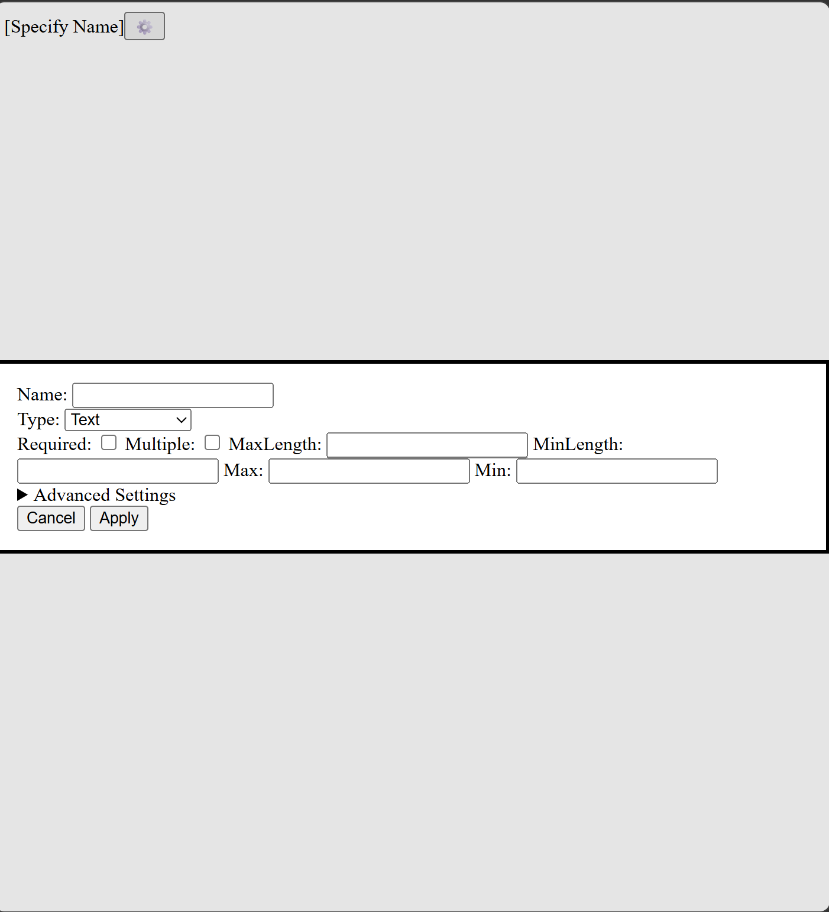

# Close Button

## Bruce's Ask

Currently, the unstyled modal dialog looks as follows:

Can you please place a fully styleable close button in the upper right corner of the dialog?

Please add your implementation notes below.